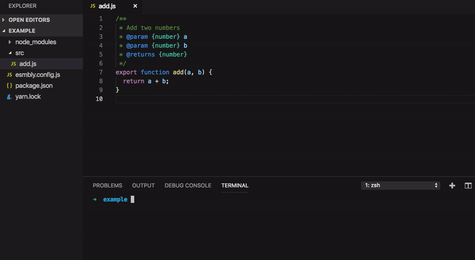

   
  

  A composable transpiler infrastructure for working with statically typed JavaScript and WebAssembly.

  
  
  
   
   

## Introduction
**Esmbly** is all about statically typed **JavaScript**. The goal is to:
- Be a useful tool for migrating between (and working with) different type systems.
- Explore different ways of collecting, transforming and utilizing type information in the JavaScript ecosystem.
- Lower the barrier for JavaScript developers that want to start experimenting and prototyping with WebAssembly by taking advantage of already existing type information in a code base.

## Use cases
- Transform a code base from Flow to TypeScript
- Turn your tests into types - generate TypeScript based on type information collected during test runs using the V8 profiler.
- Migrate from JSDoc to TypeScript - generate TypeScript based on your JSDoc comments.
- Use type information (Flow, TypeScript, JSDoc, V8) to output WebAssembly, Wat, Asm.js and AssemblyScript.

## Transformers
Esmbly is built around the concept of transformers. A transformer is responsible for transforming code from one type system to another (like for instance transforming Flow to TypeScript). 

Esmbly is designed to be composable, meaning that you can chain multiple transformers to compose your own chain of transformations (as long as their input/output formats are compatible). For example, try chaining **@esmbly/transformer-flow** and **@esmbly/transformer-wasm** to turn your Flow code into a WebAssembly binary.

#### Supported transformers
- [**@esmbly/transformer-flow**](/packages/transformer-flow): `Flow -> TypeScript`
- [**@esmbly/transformer-jsdoc**](/packages/transformer-jsdoc): `JSDoc -> TypeScript`
- [**@esmbly/transformer-v8**](/packages/transformer-v8): `JavaScript + tests -> TypeScript`
- [**@esmbly/transformer-wasm**](/packages/transformer-wasm): `TypeScript -> WebAssembly, Wat, Asm.js, AssemblyScript`

## Getting started
Read the [Getting started](/docs/getting-started.md) guide for instructions on how to get started using **Esmbly**.

## Try
Try it out in the Esmbly version of [WebAssembly Studio](https://esmbly.github.io/WebAssemblyStudio)!

## Demo
From JSDoc to TypeScript, Wat and WebAssembly in 15 seconds.

## Guides
- [Getting started](/docs/getting-started.md)
- [Using the CLI](/docs/using-the-cli.md)
- [Using the Flow transformer](/docs/using-the-flow-transformer.md)
- [Using the JSDoc transformer](/docs/using-the-jsdoc-transformer.md)
- [Using the V8 Transformer](/docs/using-the-v8-transformer.md)
- [Writing a custom rule](/docs/writing-a-custom-rule.md)
- [Writing a custom transformer](/docs/writing-a-custom-transformer.md)

## Examples
- [**Add (Flow)**](/examples/add-jsdoc-to-wasm): Transforming a simple Flow program to WebAssembly by chaining [`@esmbly/transformer-flow`](/packages/transformer-flow) and [`@esmbly/transformer-wasm`](/packages/transformer-wasm).
- [**Add (JSDoc)**](/examples/add-jsdoc-to-wasm): Transforming a simple JavaScript program with JSDoc comments to WebAssembly by chaining [`@esmbly/transformer-jsdoc`](/packages/transformer-jsdoc) and [`@esmbly/transformer-wasm`](/packages/transformer-wasm).
- [**Add (V8)**](/examples/add-jsdoc-to-wasm): Transforming a simple JavaScript program that is covered by a test suite to WebAssembly by chaining [`@esmbly/transformer-v8`](/packages/transformer-v8) and [`@esmbly/transformer-wasm`](/packages/transformer-wasm).
- [**Browser Example**](/browser-example): Using Esmbly in the browser using Webpack. Uses [`@esmbly/transformer-flow`](/packages/transformer-flow) and [`@esmbly/transformer-wasm`](/packages/transformer-wasm).
- [**Custom Rule**](/examples/custom-rule): Extending [`@esmbly/transformer-flow`](/packages/transformer-flow) with a custom rule.
- [**Custom Transformer**](/examples/custom-rule): Writing a custom transformer.
- [**Conway's Game of Life**](/examples/game-of-life): Transforming Conway's Game of Life (ported from the AssemblyScript project to JSDoc) to WebAssembly by chaining [`@esmbly/transformer-jsdoc`](/packages/transformer-jsdoc) and [`@esmbly/transformer-wasm`](/packages/transformer-wasm).
- [**Insertion Sort**](/examples/insertion-sort): Transforming an insertion sort algorithm to WebAssembly by chaining [`@esmbly/transformer-jsdoc`](/packages/transformer-jsdoc) and [`@esmbly/transformer-wasm`](/packages/transformer-wasm).
- [**Yarn/lockfile**](/examples/lockfile): Transforming [a subset of yarn](https://github.com/yarnpkg/yarn/tree/master/src/lockfile) from Flow to TypeScript.
- [**Lodash**](/examples/lodash): Transforming the entire [lodash](https://github.com/lodash/lodash) library to TypeScript based on JSDoc comments.
- [**ms**](/examples/ms): Transforming the entire [ms](https://github.com/zeit/ms) package to TypeScript based on JSDoc comments.
- [**Pad**](/examples/pad): Transforming a string pad program to WebAssembly by chaining [`@esmbly/transformer-flow`](/packages/transformer-flow) and [`@esmbly/transformer-wasm`](/packages/transformer-wasm).
- [**Radians**](/examples/pad): Transforming a utility program for transforming between radians and degrees to WebAssembly by chaining [`@esmbly/transformer-v8`](/packages/transformer-v8) and [`@esmbly/transformer-wasm`](/packages/transformer-wasm).
- [**Repeat**](/examples/pad): Transforming a utility program for repeating strings to WebAssembly by chaining [`@esmbly/transformer-v8`](/packages/transformer-v8) and [`@esmbly/transformer-wasm`](/packages/transformer-wasm).

## Contributing
All types of contributions are very much welcome. Check out our [**Contributing Guide**](CONTRIBUTING.md) for instructions on how to get started.
